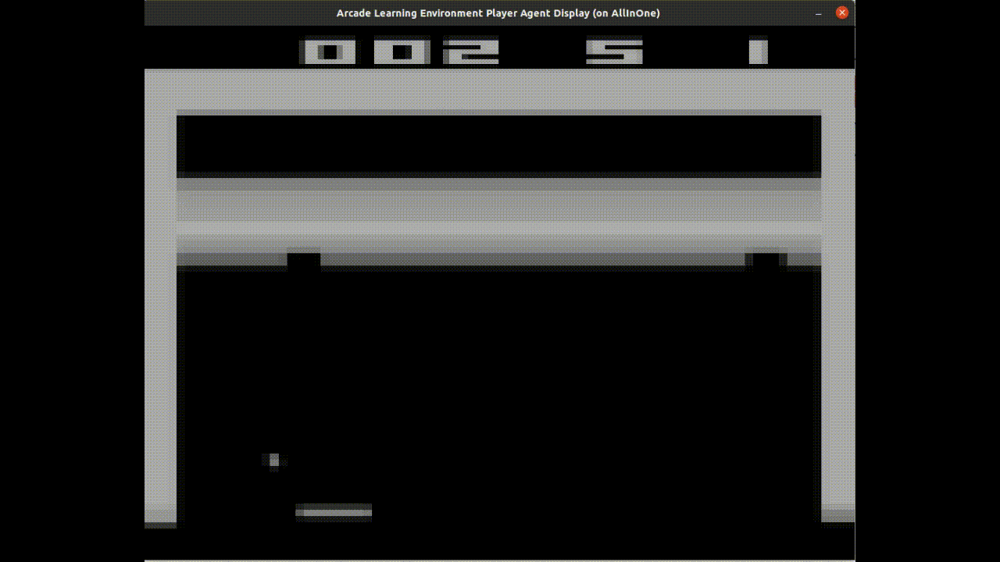
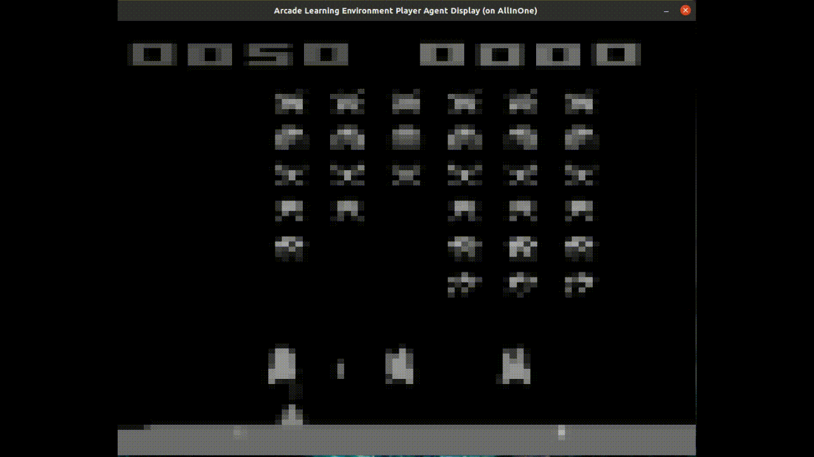
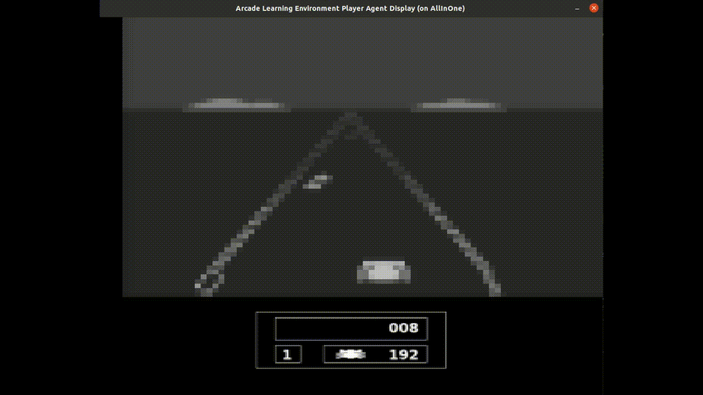

# Arcade_DQN_Research_fMRI
Associated Repository for the [manuskript]().

<div style="text-align:center;">

</div>

## Repository Content
This repository contains the code for the [paper]().
The raw behavioral data, the experimental data and the analysis outcomes, including the correlation maps for each subject, are available on [OSF](https://osf.io/9cwq4/) (DOI: 10.17605/OSF.IO/9CWQ4).  
The folder `Code` contains the code for the fMRI analysis, including code for the experiment (Python), DQNs (Baseline DQN\[1\], Ape-X\[2\], SEED\[3\]) and the GLM (MATLAB, SPM).

## Preparations
To fully utilize the code, please replace inside the `run_container` files:
- `YOUR_REPO_PATH` with the file path where this repository is located.  
- `YOUR_DATA_PATH` to specify the file path where the OSF files are stored.  
Unpack the contents of the `osfstorage-archive.zip` files.

Important: nvidia docker must be installed in order to make pytorch image work. See [nvidia](https://docs.nvidia.com/datacenter/cloud-native/container-toolkit/install-guide.html).

### Run Docker container
All three DQNs run in a Docker container. When the container is started for the first time, the Docker image must first be created. To do this, naviagte to the corresponding folder containing the Docker files and type the following command into the terminal:
```
./build_image
```
To start a container, type:
```
./run_container
```
Now you are in the Docker container and can navigate through the individual folders using the standard commands.
To give the Docker container display access type on host:
```
xhost + local:docker
```
### ROMs
When running the scripts for the first time, ensure that you download them from [here](http://www.atarimania.com/rom_collection_archive_atari_2600_roms.html) and then copy the zipped ROMs onto the host into the ROMs directory at `Arcade_DQN_Research_fMRI/Code/DQN/ROMs`. Afterward, run a SEED container and enter the following command:
```
cd /workspace/ROMs
unrar e Roms.rar
unzip ROMS.zip
unzip "HC ROMS.zip"
rm ROMS.zip
rm "HC ROMS.zip"
rm Roms.rar
python -m atari_py.import_roms /workspace/ROMs
```
Following that, the data within the container must be copied from `/usr/local/lib/python3.6/dist-packages/atari_py/atari_roms` to `/workspace/ROMs`.
We only used the games Breakout, Space Invaders and Enduro for our investigation. 

<div style="display:flex; justify-content: space-around;">
  
  
  
</div>


## DQNs

### Baseline DQN
This DQN implementation is a practical realization of the theory presented in this [paper](https://www.nature.com/articles/nature14236).  
The corresponding folder includes the code files: `Training_Baseline_DQN.py` for independently training the DQN, `Baseline_DQN_live_inference.py` to showcase the standalone gameplay of the baseline DQN, and `Feature_Generation.py` for generating features for the encoding model.

### Ape-X
Our code for implementing Ape-X was built on this [original repository](https://github.com/neka-nat/distributed_rl) (license: MIT license) and is based on this [paper](https://arxiv.org/pdf/1803.00933.pdf).  
Modifications were made to adapt it to our specific data analysis pipeline. Changes have been marked in each code file. Adjusted versions of the existing code tailored to our problem are present in the corresponding folder.  
To train Ape-X for our specific case, please replace the files in the original repository with our modified versions. Refer to the README.md in the original repository for training initiation instructions.

In the associated folder, you'll find the original repository and the code files `ApeX_live_inference.py` to demonstrate the independent gameplay of the baseline DQN with arcade games and `Feature_Generation.py`for generating features for the GLM. These code files were authored by us and incorporate functions from the original code. This has been explicitly indicated in the code.
 
### SEED
The original code to implement SEED can be found in this [repository](https://github.com/google-research/seed_rl) (license: Apache License 2.0) and is based on this [paper](https://arxiv.org/abs/1910.06591).  
First, see README.md of the original repository. We did not train SEED independently; instead, we utilized pre-trained networks for feature generation. Network weights from Google can be downloaded [here](https://console.cloud.google.com/storage/browser/seed_rl_external_data_release/seed_r2d2_atari;tab=objects?pageState=(%22StorageObjectListTable%22:(%22f%22:%22%255B%255D%22))&prefix=&forceOnObjectsSortingFiltering=false) and extracted files must be copied to the host `~/Arcade_DQN_Research_fMRI/Code/DQN/SEED/container_mount/checkpoints`.

In the associated folder, you'll find the original repository, the code files `SEED_live_inference.py` to demonstrate the independent gameplay of the baseline DQN with arcade games and `Feature_Generation.py`for generating features for the GLM. These code files were authored by us and incorporate functions from the original code. This has been explicitly indicated in the code.

In order to make cuda compute capability 8.6 work with tf 2.4.1, we have to replace the file ptxas of cuda 11.0 (located at `/usr/local/cuda-11.0/bin/ptxas` inside the container) by the ptxas of cuda 11.2 (see [here](https://github.com/tensorflow/tensorflow/issues/45590#issuecomment-780678654)). Once copied from the cuda 11.2 - container to `/Arcade_DQN_Research_fMRI/code/DQN/SEED/container_mount/cuda_11_2_ptxas_file/ptxas` the file must be copied manually into the seed-rl-basteln container after every rebuild (to /usr/local/cuda-11.0/bin/ptxas).

To import ROMs into gym, run inside container:
```
python -m atari_py.import_roms /workspace/ROMs
```
## fMRI analysis pipeline
After preprocessing the fMRI data, we computed a general linear model (GLM) for motion correction, using the six motion parameters (three translations and three rotations) as regressors, and the preprocessed fMRI signal as the dependent variable. This was implemented using the scripts `S02_create_GLM_empty_onsets.m` and `S03_GLM_empty.m`. To solve the encoding model, we constructed a design matrix consisting of the activations of the DQN neurons from the hidden layers (see `S05_design_matrix_layer_x.m`). The regularized GLM was fitted for each of the five sessions, and prediction accuracy was evaluated using cross-validation (see `S06_layer_x_estimate.m` and `S07_layer_x_cross_validation.m`). For visualization and further analysis, we used the SPM software.
For the analysis of the behavioral data, see also the [GitHub repository] (https://github.com/SHaberland15/Arcade_DQN_Research).

## References:
\[1\] Volodymyr Mnih, Koray Kavukcuoglu, David Silver, Andrei A. Rusu, Joel Veness, Marc G. Bellemare, Alex Graves, Martin Riedmiller, Andreas K. Fidjeland, Georg Ostrovski, Stig Petersen, Charles Beattie, Amir Sadik, Ioannis Antonoglou, Helen King, Dharshan Kumaran, Daan Wierstra, Shane Legg, and Hassabis Demis. Human-level control through deep reinforcement learning. Nature, 518(7540):529–533, 2015.  
\[2\] Dan Horgan, John Quan, David Budden, Gabriel Barth-Maron, Matteo Hessel, Hado van Hasselt, and David Silver. Distributed prioritized experience replay. In International Conference on Learning Representations, 2018.  
\[3\] Lasse Espeholt, Raphaël Marinier, Piotr Stanczyk, Ke Wang, and Marcin Michalski. Seed rl: Scalable and efficient deep-rl with accelerated central inference. In 8th International Conference on Learning Representations, 2019.


